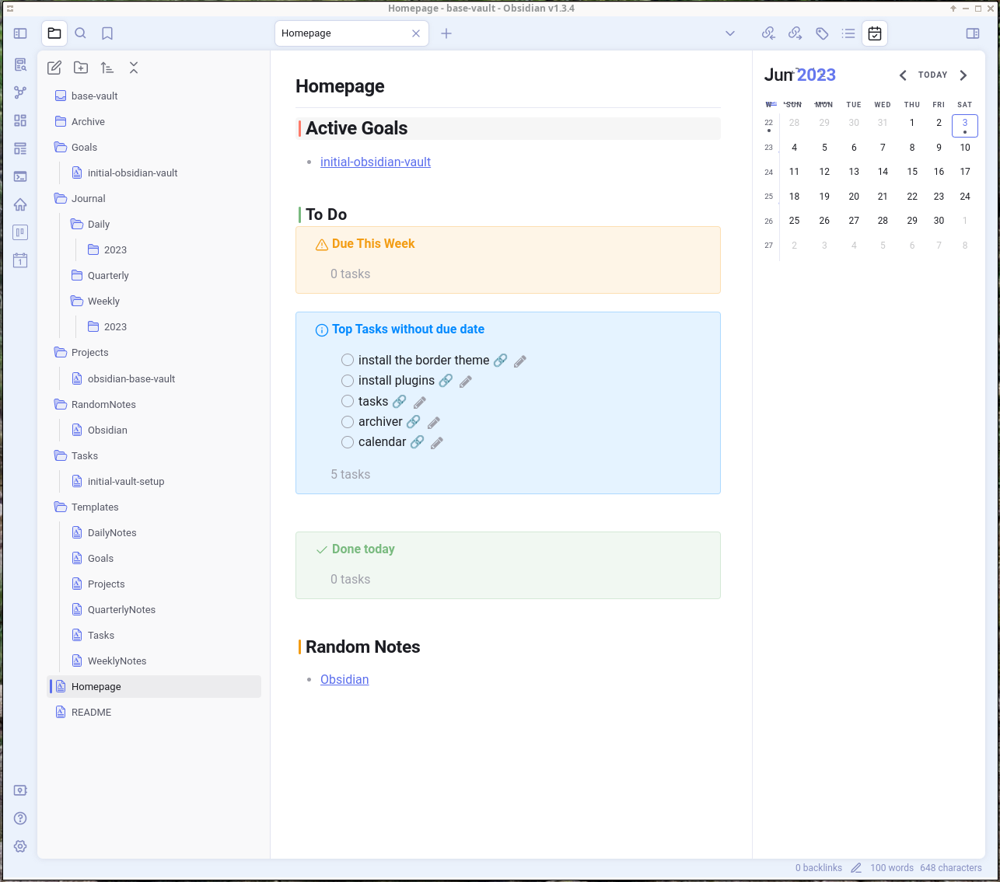

# Obsidian Base Vault

I use [obsidian](https://obsidian.md/) to take notes, as well as manage my to do lists, set and track my goals, manage my projects and keep random notes about stuff I feel I may need to know about in the future.

For this base Vault I use the [Border](https://github.com/Akifyss/obsidian-border) theme. That's a personal preference because the theme is light, but not too much, keeps all the interesting icons visible and it plays nice with mobile.

# Plugins

This base vault use most of the default core plugins - except for the daily notes, and have the following community plugins enabled:

- **[Homepage](https://github.com/mirnovov/obsidian-homepage)** - the homepage plugin adds a home icon in the sidebar and always open a predefined Note when the vault is opened - in the case of this vault the page is called Homepage, and can be seen above.

- **[Tasks](https://github.com/obsidian-tasks-group/obsidian-tasks)** - the tasks plugin allow adding lists of tasks inside notes, as well as created list of those tasks, based on different criteria. see [[initial-vault-setup]] for an example. The three boxes in the homepage above are listed dynamically from tasks present in the whole vault.
  
- **[Dataview](https://github.com/blacksmithgu/obsidian-dataview)** - dataview allow querying the notes in the vault for all types of information. the homepage screenshot above uses it to list random notes from the RandomNotes folder, as well as the active goals.
  
- **[Calendar](https://github.com/liamcain/obsidian-calendar-plugin)** - the calendar plugin create the calendar in the right side of the screenshot above, which opens or creates daily and weekly notes when the day or week numbers are clicked. It plays well with the Periodic Notes plugin.
  
- **[Periodic Notes](https://github.com/liamcain/obsidian-periodic-notes)** - the periodic notes plugin is a enhancement on the core `Daily Notes` plugin. It allows the configuration of daily, weekly, monthly, quarterly and yearly notes. In this vault only daily, weekly and quarterly notes are enables because of how I use them - see the [[#12 Weeks Year]] for details
  
- **[Archiver](https://github.com/ivan-lednev/obsidian-task-archiver)** - the archiver plugin deletes or moves completed tasks from one note to another. It is specially useful with recurring tasks. 
  
- **[Emoji Shortcodes](https://github.com/phibr0/obsidian-emoji-shortcodes)** - type emojis in the notes using :<some_emoji_name>:, basically, the same way you do in github or slack. Handy to make notes more colourful.

- **[Heatmap Calendar](https://github.com/Richardsl/heatmap-calendar-obsidian)** - not currently being used in the base vault, but it is hand to make heatmap calendar like the activity calendar in github.

- **[CardBoard](https://github.com/roovo/obsidian-card-board)** - Nice to make kanban board with tasks - not configured in the base vault because I use it differently depending on the specific vault. In my main personal vault, for instance, I use it with 4 columns: **overdue**, **today**, **tomorrow**, **this week**.

# Work Planning

In this base vault I have four levels of detail for work: **Projects**, **Goals**, **Tasks** and **To Do Items**. In my personal Vault I have another level **Ideas**, but in the majority of my vaults I don't need that extra level, so I didn't include a folder or template for them. but I'll explain it anyway.

- **Ideas** - ideas are potential projects, but I'm not planning on starting anytime soon. When I start playing with some possible project in my idea a bit too much, I create a note in the Ideas folder and add all the details I can think of - this may include context, what it is, how it would work, why it seems like a good idea, etc. For a lot of my ideas that is enough for me to stop thinking about them. If new details pop into my head I may keep adding them to the Ideas note.

- **Projects** - When I decide that an Idea is good and valuable enough to work on, I move it to projects and start organizing it a bit more, splitting it in goals and make it more concrete from the point of view of execution, instead of just thinking about what it is, the problems it would solve or what functionality it would have, at this point I start thinking about how to make it work - what would I need to do to put it live.

- **Goals** - for each project I am currently working one or planning on working in the short term (this quarter or next at most) I create some goals. Each goal needs to be achievable in a single quarter and can be split in as many tasks as needed. Goals are based on output - complete a functionality, signup a new client.

- **Tasks** - a task is a stepping stone to reach a goal. Tasks are, generally, small enough that can be completed in a week, but big enough that represent a significant step forward to achieve the goal they are part of. Tasks are about input. Things that can be controlled - Call 100 potential clients, create an google add for the new book, etc.

- **To Do Items** - tasks are then further split up in To Do Items, which can be done atomically - reproduce the bug; create a test case for the bug; find out the details of the bug; fix the bug. As much as possible To Do Items should be doable in a single go. It doesn't always go like that - reproduce the bug may be simpler than reproducing it consistently, which is what is needed to create a test case for it.

# 12 Weeks Year

The work organization above is heavily inspired by the [12 Weeks Year](https://12weekyear.com/) books and videos, and the same applies to the whole Vault organization and templates.

So, here is how I use the daily, weekly and quarterly notes:

- **Quarterly** - At the end of every quarter - usually in the last weekend of each quarter - I look at the projects I have currently in progress and I ask:
	- is this project done?
	- if not, does it still serve my needs and interests?
	  
	This questions allow me to decide on which of the projects I'm currently working on I want to keep working on the next quarter, and which to close, keep by on KLO (Keep the Lights On) mode.
	
	If I end with a small enough list of projects, I may pick some other project.
	
	Armed with this I think about what are the next Goals to move each of the projects forward. For each of those goals, if I don't have a note yet, I create one.
	
	At the end of the quarter I review if the goals planned for that quarter were achieved.

- **Weekly** - For each of the Quarterly goals I find a list of tasks that need to be done to achieve the goal and to each week I assign one or two (max three) Tasks - total, not per project or goal.
  
  In some case in the beginning of the quarter, sometime in the beginning of the week, I pick those tasks as add them to the weekly note as Focus items for the week.
  
  At the end of the week I review how the tasks for the week went and if I need to overclock the next week to get them in line.

- **Daily** - I use the daily notes for trivialities as well as to log the work and/or progress done on the tasks of the week.

A normal daily note may look like:

> - found documentation about how to deploy code in system MFE-extra
> - made significant project on the item change footer of #tasks/initial-vault-setup, which is the focus of #2023-W22 and part of #goals/initial-obsidian-vault  
> - found 12 weeks year website a bit too aggressive, commercially.

I don't always tag the task and the goal and the week. Generally I tag the task, and only tag the goal when I finish a task or otherwise make significant progress on the goal.

### Why not Monthly or Yearly notes?

Month is too big for tasks and too small for significant goals and is an awkward middle ground between weeks and quarters, and Yearly is too big to focus on anything.

# Tags

I use tags for projects, goals, tasks, quarters and weeks and add those tags everywhere to have notes listed automatically on other notes.

Because the weekly, quarterly, project, goal and task templates all list notes that refer to their specific tags, by adding those tags in other notes creates a web of links based on the tags.

the tags used have the format: `#projects/<project-name>` , `#goals/<goal-name>`, `#tasks/<task-name>`, `#<year>-Q<quarter>` and `#year-W<week>`. 

# Contributing and Issues

Pull requests are welcome and will be given the utmost attentions, as well as any [Issues opened](https://github.com/magick-source/obsidian-base-vault/issues).

You can also contribute with caffeine, just [buy me  a coffee](https://www.buymeacoffee.com/themage).

👋